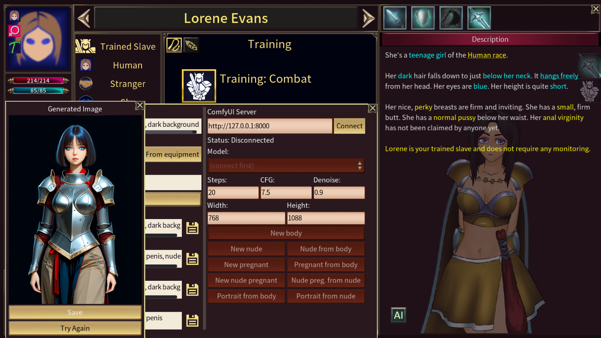
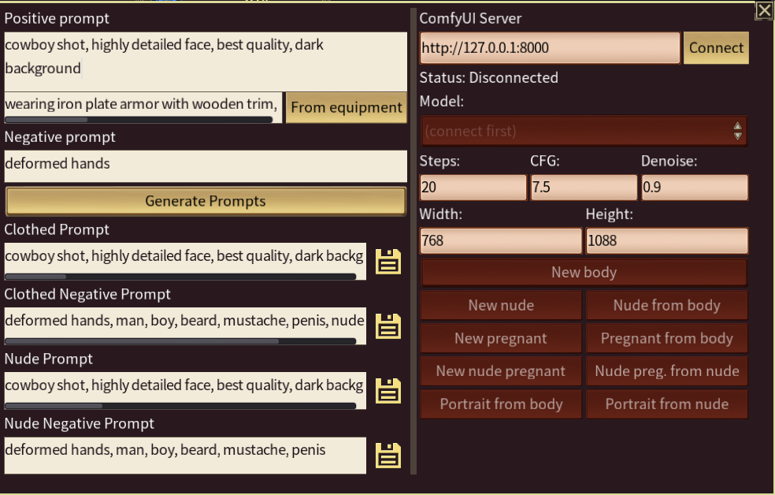
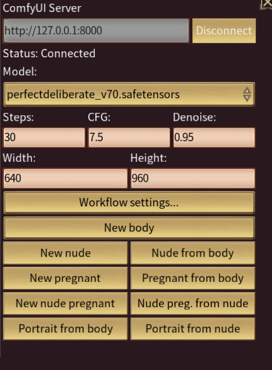
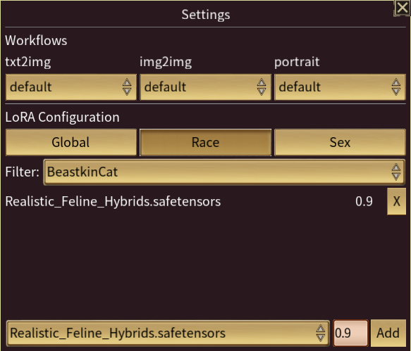

# Strive: Conquest Portrait Generator

This mod enables two features in Strive: Conquest:

- Generation of prompts suitable for image generation with an AI tool like ComfyUI or similar.
- Direct integration with a ComfyUI installation running on the local network.

If you have ComfyUI installed, you can use this mod to directly generate character portraits.

## Installation

1. Download the mod from [Github releases](https://github.com/pyro944/s4c-mods/releases).
2. Copy the PortraitGenerator mod folder into your Strive: Conquest user folder.
   - Windows: `%AppData%/Strive for Power 2/mods`
   - Linux: `~/.local/share/Strive for Power 2/mods`
   - Mac: `~/Library/Application Support/Strive for Power 2/mods`
3. (Optional) Also install the Exposure mod from [MFDMMods](https://itch.io/t/3000638/link-fixed-preg-hopefully-fixed-minimally-fucky-diffusion-megapack-mod-5k-body-and-portrait-sets-22k-images-including-clothed-exposed-and-pregnancy-male-and-female-every-race-hair-color-etc) so you can use all the portrait types in-game.
4. Launch Strive: Conquest.
5. Open the mod manager and enable Portrait Generator.
6. Restart Strive: Conquest.

### ComfyUI Integration

To generate portraits in-game, you'll need ComfyUI and sufficient hardware to handle image generation.
I don't have advice for system requirements. Instead, you should refer to the [ComfyUI documentation](https://docs.comfy.org/installation/system_requirements).

1. Install ComfyUI using whatever method you prefer. I recommend the [desktop installation](https://docs.comfy.org/installation/desktop/windows) because it comes packaged with all the configuration and tools we'll need.
   - You need ComfyUI `0.16.4` or newer.
2. Launch ComfyUI.
3. Adjust and verify some settings.
   1. Click the Settings button in the bottom left of the screen.
   2. On the "Comfy" settings page, enable Dev Mode.
   3. Click the "Server-Config" settings page.
   4. Note the port that the server is listening on. It's typically `8000`, but please take note if it's different. You'll need the port later.
   5. Scroll all the way down to "General" and find the "Use legacy Manager UI" setting. Make sure this is toggled _on_. The new UI does not have all the features we need.
4. Open the Manager UI. You can get there two ways:
   - Near the top right of your screen, there should be an "Extensions" button.
   - In the top left of your screen, there's a C logo menu. In that menu, the "Extensions" menu item will also open the manager.
5. Click "Custom Nodes Manager".
6. Search for and install these nodes:
   - `ComfyUI_FaceAnalysis`
   - `rgthree-comfy`
   - `ComfyUI Impact Pack`
   - `ComfyUI Impact Subpack`
7. Close the node manager.
8. Click "Model manager".
9. Search for and install these models:
   - `face_yolov8m (bbox)`
10. Close the model manager.
11. Restart ComfyUI.

Finally, you'll need at least one checkpoint model. When you first open ComfyUI, it will have some helpful suggestions to get you started.

See the [ComfyUI documentation](https://docs.comfy.org/get_started/first_generation#3-model-installation) for more information about installing models.

### Workflow Dependencies

These are the models and node packs that each workflow requires:

| Workflow                    | Node Packs                                                 | Models                           | Description                                                                                   |
| --------------------------- | ---------------------------------------------------------- | -------------------------------- | --------------------------------------------------------------------------------------------- |
| txt2img/default             | rgthree-comfy                                              | None                             | Create an image based on text prompts. `denoise` is ignored.                                  |
| img2img/default             | rgthree-comfy                                              | None                             | Create an image based on an existing image and a text prompt.                                 |
| img2img/preserve-face       | rgthree-comfy, ComfyUI Impact Pack, ComfyUI Impact Subpack | `face_yolov8m (bbox)`            | Create an image based on an existing image and a text prompt, but preserve the original face. |
| portrait/default            | ComfyUI_FaceAnalysis                                       | At least one `insightface` model | Create a square crop around the subject's face.                                               |
| portrait/ultralytics-simple | ComfyUI Impact Pack, ComfyUI Impact Subpack                | `face_yolov8m (bbox)`            | Create a square crop around the subject's face.                                               |

## Usage

### Basic usage

1. Start or load a game.
2. Open a character's info page.
3. Click the new "AI" button on the bottom of the character's portrait.
4. Enter any prompts you like. For example:
   - Positive prompt: `cowboy shot, highly detailed face, best quality, dark background`
   - Clothing: Click the button to load the character's current equipment!
   - Negative prompt: `deformed hands`
5. Click the "Generate" button to produce prompts based on the character's stats.
   - You can modify any of the generated prompts as you see fit.
6. Click any of the save icons next to the prompts to copy the corresponding prompt to your clipboard.

### ComfyUI integration

1. Open ComfyUI in the background.
2. As above, click the "AI" button to open the mod UI.
3. In the right column, enter the your local ComfyUI server address into the "ComfyUI Server" field.
   - The default, `http://127.0.0.1:8000`, is probably correct. Try pressing "Connect" to see if it works.
   - If you are using a different port (see the ComfyUI settings steps in the previous section), change `8000` to whatever port you're using.
4. Click "Connect" to connect to the server.
5. Select the model you'd like to use for image generation.
6. (Optional) Adjust the image generation settings if you know what you're doing.
7. Click "New body" to generate a body image.
8. Wait a bit.
9. When the image preview pops up, click "Save" to save the image to your character.

After saving, you'll have new options. You can use the saved image as a base for generating the nude and pregnant sprites, and you can click "Portrait from body" to crop the image to a square portrait.

Clicking any of the "New" options will produce a fresh image totally independent of the character's current body image.

Feel free to edit the prompts as you see fit. The game will not overwrite them unless you press the "Generate" button again.

### Advanced usage

#### Workflows

You can import your own workflows if you're comfortable working with ComfyUI. The mod will populate the following nodes if they are present:

- A `StringPrimitive` node titled `positive_prompt`.
- A `StringPrimitive` node titled `negative_prompt`.
- An `IntPrimitive` node titled `steps`.
- An `IntPrimitive` node titled `seed`.
- A `FloatPrimitive` node titled `cfg_scale`.
- A `FloatPrimitive` node titled `denoise`.
- A `LoadImage` node titled `source_image` that loads the source image.
- A `Power Lora Loader (rgthree)` node for loading LoRAs.
- A `LoadCheckpoint` node that loads your checkpoint.

You will also need at least at least one `SaveImage` node to output your generated image.

To import your workflow into the mod, open it in ComfyUI, go to File > Export (API), and then save it into `<mod root>/workflows/<workflow type>`. For example, save a new txt2img workflow to `<mod root>/workflows/txt2img/my-fancy-workflow.json`.

To use your workflow, open the mod panel from the character info screen, click "Workflow settings...", and select your workflow from the dropdowns at the top.

#### LoRAs

The mod can automatically pull in any LoRAs you have installed. Currently, you can configure which LoRAs to use and at what strength based on the character's race and sex. You can also configure global LoRAs to always use regardless of the character's attributes.

LoRA settings are in the "Workflow settings..." panel.

## Known limitations

- The current release is pretty rough around the edges. You will find bugs. Please report them here.

## Troubleshooting

### I can't connect to the ComfyUI server

1. Make sure ComfyUI is running.
2. Make sure you have the right port. As a reminder, the port is configured in ComfyUI -> Settings -> Server-Config -> Network -> Port.

### Image generation is very slow

1. When using a model for the first time after opening ComfyUI, it will take a bit to load the model into memory.
2. Ultimately, generation time is a function of these factors:
   - Your computer's hardware. The better your GPU, the faster your results.
   - Steps. More steps of generation produce more refined results, but take longer.
   - Image size. Larger images take longer.

### I have another computer on my network that can generate images, but I don't play Strive on it. How can I use it for image generation?

1. In your ComfyUI settings, go to Server-Config and change the Host setting to 0.0.0.0.
2. Restart ComfyUI and allow it through your firewall with whatever tools your OS gives you.
3. In the in-game mod interface, set the ComfyUI server to the address of the computer that's running ComfyUI.

### I can't install nodes in ComfyUI / The mod is reporting some kind of `400` error.

ComfyUI has a fairly new security scheme that seems to sometimes interfere with the manager's ability to install nodes. This should only affect you if you're trying to expose ComfyUI over the network. I had to fix it as follows:

1. Find your `config.ini` file. On Windows, I found this in `<ComfyUI User Directory>/user/__manager`. You would have configured the user directory during installation.
2. Change `security_level` to `weak`.
3. Change `network_mode` to `personal_cloud`.

### I'm seeing an error that looks like "[Errno 22] Invalid argument" or ComfyUI isn't returning images to Strive.

This usually indicates a problem with ComfyUI's configuration. As discussed in [this issue](https://github.com/Comfy-Org/ComfyUI/issues/6178), try changing the port that ComfyUI is using (in the Server-Config settings).

### The default portrait workflow isn't working.

Try using `ultralytics-simple`. It does the same job but uses a different set of node packs. Refer to the Workflow Dependencies section above to ensure you have all the dependencies installed.

### ComfyUI generated an image, but it's not showing up in-game.

Comfy sometimes doesn't seem to report all the information we need. As a fail-safe, there is a button labeled
"Fetch last" that will try to get the result of the last-executed prompt. Try using that to import your images into the game.

## Acknowledgements

- Special thanks to **Zeep** on Discord for helping me get to know ComfyUI and for tons of advice on workflows.
- Special thanks to Claude Code for writing pretty nearly all of this mod.
